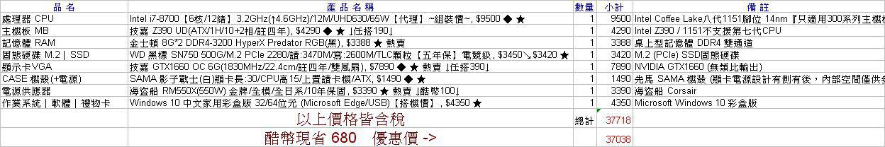

## 如何選購/組裝電腦
- [原價屋](https://www.coolpc.com.tw/evaluate.php)
  - 下方有瓦數估計、現金估計
- **總結**：
  - CPU：誰比較貴，誰比較好
  - 主機板：GIGABYTE 第五代超耐久™ 主機板
  - 記憶體：金士頓 HyperX Predator
  - 硬碟：HGST &gt; Toshiba
  - 電源供應器：海盜船 / 海韻 （或是有全日系產品，如振華）
  

 
 

### 中央處理器(CPU)
#### 關鍵字：
- Intel: 
- AMD: 
- 時脈(頻率)： XX GHz，一個週期內，CPU 可執行的次數
#### 文章：
- [「電腦選購」CPU 挑選.選購法則 Intel v.s AMD (2019.4月更新)](https://aton5918.pixnet.net/blog/post/213482968)
  - 哪個CPU比較厲害?
    > 誰比較貴，誰比較好
- [【電腦組裝】CPU 的介紹與選購：Intel & AMD (2019.4月更新)](https://ofeyhong.pixnet.net/blog/post/59877783)
- [【電腦知識】AMD 好還是 INTEL 好??](http://momosagax.pixnet.net/blog/post/180974723)

 
 

### 主機板(Motherboard)
#### 關鍵字：
- 電感：方形，儲能整流(穩定電流)
- 電容：圓形，蓄電濾波，穩定供電給 CPU
#### 文章：
- [「電腦選購」主機板 挑選.選購法則 (2019/4月更新)](https://aton5918.pixnet.net/blog/post/213507130)
- [【電腦組裝】主機板的介紹與選購建議 (2019.2月更新)](https://ofeyhong.pixnet.net/blog/post/59878626)
- [何謂 DisplayPort](https://newguest88.pixnet.net/blog/post/346807858)
  - 結論：比 HDMI 2.0 更先進
- 技嘉
  - [技嘉第二代超耐久系列 高品質電源模組設計](https://www.gigabyte.com/tw/webpage/9/article_08_ultra_durable2.htm)
    - [技嘉第二代超耐久主機板介紹](https://www.gigabyte.com/MicroSite/30/tech_070427_ud2.htm)
       
    - [產品](https://www.gigabyte.com/MicroSite/30/tech_070427_ud2-models.htm)
       代碼D: 第2代超耐久主機板設計
  - [GIGABYTE 第五代超耐久™ 主機板](https://www.gigabyte.com/tw/MicroSite/312/images/ultra-durable.html)
    - 電腦用的久 只選超耐久™ 主機板
  - [耐用沒煩惱 技嘉主機板 質選超耐久(2018年3月16日)](https://tw.aorus.com/blog-detail.php?i=215)
    - 不管是UD系列、SOC系列、DESIGNARE系列或是現在最夯的AORUS系列，全部都是超耐久的產品。
    - 超耐久金屬防護裝甲 不怕插槽毀損 板身彎曲
      - 保護 PCIe/記憶體插槽
    - 防範於未然 抗硫化電阻不能沒有
    - 超耐久概念始祖 不能不提的雙硬體 BIOS 設計
      - 近6成的玩家送修主機板的原因是 BIOS 異常
  - [GIGABYTE 技嘉科技 GA-H61M-DS2 (rev. 5.0)](https://www.gigabyte.com/tw/Motherboard/GA-H61M-DS2-rev-50#ov)
    - 抗潮濕 – 高密度開纖布電路板
    - 抗靜電 – 防靜電晶片
    - 抗突波 – 防突波晶片及專利雙實體BIOS
    - 抗高溫 – 全固態電容及超低電阻式電晶體
    - 全固態電容
   
#### 產品：
- [GIGABYTE 超耐久系列](https://www.gigabyte.com/tw/Motherboard/Ultra-Durable%E2%84%A2)
  - 超耐久系列
     - Z390 DESIGNARE
     - Z390 M
     - Z390 UD
     - B365M D2V
     - B450M DS3H
     - B450M S2H
     - H370 HD3
     - H370M D3H
     - H370N WIFI
     - B360 HD3
   - [超耐久系列 Z390 比較](https://www.gigabyte.com/tw/Comparison/Result/2?pids=6642,6653,6789)
   - [超耐久系列 Z390 與 Z170, X99 比較](https://www.gigabyte.com/tw/Comparison/Result/2?pids=5478,5807,6642,6653,6789)
   - [Z390 UD - ULTRA DURABLE](https://www.gigabyte.com/tw/Motherboard/Z390-UD-rev-10#sp)
 
 

### 記憶體(Memory)
#### 關鍵字：
- 動態隨機存取記憶體(DRAM, Dynamic Random Access Memory)
#### 文章：
- [記憶體 RAM 基本常識：容量大小、時脈、傳輸速度與插槽規格](https://blog.gtwang.org/tips/effect-of-ram-size-and-frequency/)
- [記憶體單通道 vs. 雙通道性能評測，跑雙通道比較有用嗎？](https://www.techbang.com/posts/12220)
  - 幀數，對 CPU 不受影響
  - 幀數，對 GPU 影響較大，進步幅度為 25％～45％ 左右
- [認識SSD的SATA/mSATA/PCIe/M.2四種接口](https://blog.xuite.net/toyota5168/computer/545657931)
  - 金士頓和 HyperX 為代表的 SSD 品牌，已完全主導硬碟存儲市場。
  - PCIe 代表產品：HyperX Predator PCIe SSD (佼佼者)
  - SSD 讀寫效能：
    - PCIe 資料 → CPU (高速公路)
    - SATA 資料 → 記憶體 → CPU (崎嶇山路)
  - PCIe 會占用總線通道，只有配合 Z170、X99 這樣頂級平台，才可以完全發揮 PCIe SSD 的性能。
  
#### 產品：
- 金士頓(Kingston)介紹
  - [HyperX FURY DDR4](https://www.hyperxgaming.com/tw/memory/fury-ddr4)
     自動超頻到 3466 Mhz，提昇遊戲、影像編輯、3D繪圖效能
     
  - [效能設定檔](https://www.hyperxgaming.com/tw/memory/overclocking-education)：以 Mb/s 為單位的記憶體讀取 (越高越好)
      - 超頻：
        - HyperX Predator DDR4 / 3600MHz / 50004 MB/s
           (有些高階主機板只支援到 3200MHz，要查閱主機板)
        - HyperX Predator DDR4 / 3000MHz / 42411 MB/s
        - Kingston DDR4 / 2666MHz / 37463 MB/s
      - 隨插即用
        - HyperX Predator DDR4 / 2666MHz / 39248 MB/s
        - HyperX Fury DDR4 / HyperX Impact DDR4 / 2666 MHz / 38032 MB/s
        - Kingston DDR4 記憶體 / 2666 MHz / 37463 MB/s
   - 注意：
      - 不是買越高頻的就越好，要看主機板有沒有支援
      - 像 [Gigabyte B450M](https://www.gigabyte.com/tw/Motherboard/B450-AORUS-M-rev-10#sp) 高階主機板，在不超頻的情況只能使用到 2933Mhz
   
 
 

### 硬碟(Disk)
#### 關鍵字：
- HGST (昱科環球儲存)：[2011年被威騰電子收購](https://home.gamer.com.tw/creationDetail.php?sn=2699973)
- Toshiba (東芝)
- WD / WDC/ Western Digital (威騰/電子)
- Seagate (希捷)
#### 文章：
- [Backblaze硬碟故障率報告：HGST最可靠、Seagate 4TB故障率29.08%](https://www.cool3c.com/article/132999)

#### 產品：
- [[momo]【TOSHIBA】Galaxy SATA 企業級硬碟 8TB 3.5吋 SATAIII 7200轉硬碟 五年保固(MG05ACA800E)](https://www.momoshop.com.tw/goods/GoodsDetail.jsp?i_code=4801076)
  - 2019.05.08：特價7499，每 GB 價格 0.9373 元（=7499/8000）

 
 

### 電源供應器
#### 關鍵字
- 80 PLUS 認證等級：鈦金牌 > 白金牌 > 金牌 > 銀牌 > 銅牌
- 轉換效率： 
#### 文章：
- [https://aton5918.pixnet.net/blog/post/222695850](「電腦選購」POWER 電源供應器 挑選.選購法則 (2019.1月更新))
  - 好的Power大都在550W以上，350W(含)以下的Power，ATon建議不要購買
  - ATon個人較常選用 海韻 / 酷碼 這兩家的Power
- [[歐飛先生]【電腦組裝】電源供應器介紹與選購 (2019.4月更新)](https://ofeyhong.pixnet.net/blog/post/57302139)
- [我的搭配要買幾瓦電源供應器？！簡單判定法！](https://www.coolpc.com.tw/phpBB2/viewtopic.php?f=21&t=55325)
- [電源規格科普：AT / ATX / SFX / TFX / FLEX 什麼鬼？](https://kknews.cc/zh-tw/digital/5rlok.html)

#### 產品
- [鈦金牌](https://24h.pchome.com.tw/store/DSAZ0C)
  - 海韻x4 / 海盜船x3 / 銀欣x1

- [白金牌](https://24h.pchome.com.tw/store/DSAZ0D)
  - 海盜船x9 > 全漢x5 > 華碩x4 > 海韻x3 >= Cooler Masterx3 > 銀欣x2

- 所以，挑有能力設計高階電源供應器的廠商：海盜船 / 海韻

#### 評價
- [海韻燒掉主機版](https://www.mobile01.com/topicdetail.php?f=501&t=5058110)
- [記錄海韻電源供應器的故障記錄，網友也可以回報！從神壇跌落的炮兒，回不去了！](http://kato3c.pixnet.net/blog/post/436890037)
- [振華系 則是在巴哈電應版的負指標 被置頂文章所公幹的 沒OCP的渣電供玩意](https://forum.gamer.com.tw/Co.php?bsn=60030&sn=1935931)

#### 中英對照
- 海盜船(Corsair)
- 海韻(Seasonic)
- 銀欣(SilverStone)
- 全漢(FSP)
- 華碩(ASUS)
- 酷碼(Cooler Master)
- 安鈦克(Antec)

 
 

### Windows 作業系統
#### 關鍵字：
- **彩盒版**：限定一台電腦註冊，可重複轉移且重新註冊
- **隨機版**：限定一台電腦無法轉移及無法重新註冊，且綁定主機板cpu
#### 文章：
- [如果手邊有win7的電腦系統可以免費升級win10](https://www.mobile01.com/topicdetail.php?f=300&t=5714807)
- [windows10隨機版與彩盒版的差異](https://www.mobile01.com/topicdetail.php?f=300&t=4774533)

 
 

### 無線網卡
- [[Wi-Fi] IEEE 802.11 a/b/g/n/ac 有什麼差別？](https://bryceknowhow.blogspot.com/2013/11/wi-fi-ieee-80211-abgnac.html)
  - 802.11ac: 5GHz / 200~866.7Mbps (有效距離 35m)
  - 802.11n: 2.4GHz / 150~600Mps (有效距離 70m) (首選)
  - 802.11g: 2.4-2.5Ghz / 54Mbps (有效距離 30m)
  - 802.11b: 2.4-2.5Ghz / 11Mbps (有效距離 30m)
  
- 不太推薦 [EDIMAX 訊舟EW-7711USn USB無線網路卡](https://24h.pchome.com.tw/prod/DRAF9C-A81315619)
  - 故障率：
    - 一台：用一年多就故障，送修
    - 另一台：用了 3 年 3 個月出現故障，Ubuntu / Windows7＆10 有出現Wifi訊號，但皆無法連線
    - 不要說是機王，品質明明就有問提
  - 假環保：
    - 10多年前，早期的 EDIMAX 無線網卡還用的好好的
    - 現在的 3C 產品都偽裝成「綠色產品/環保產品」，卻一點也不耐用
    - 結果又買新的，製造更多 3C 垃圾，根本是假環保！
  - OS 支援度：
    - 若要用在 Linux 環境，則以 EDIMAX 最佳（無須安裝驅動程式）
    - 像他牌 TOTOLINK A2000UA 在 Ubuntu 環境抓不到

 
 

### 電腦保養
- [『電腦防塵』分享一下防塵PVC網](https://www.mobile01.com/topicdetail.php?f=299&t=3984125)
  - [特價！PVC防塵濾網/沖孔網/機殼防塵網/風扇防塵網/電腦濾網 孔徑1mm](https://goods.ruten.com.tw/item/show?21614402418373)

 
 

### 題外話 - 其他配備

#### [藍芽發射器 / 藍牙發射器](https://ecshweb.pchome.com.tw/global/tw/v3.3/?q=%E8%97%8D%E8%8A%BD%E7%99%BC%E5%B0%84%E5%99%A8&scope=all&sortParm=prc&sortOrder=ac)
  - [Avantree 迷你型藍牙傳輸發射器(DG40S)](https://global.pchome.com.tw/prod/DYAQ5G-A9007Z7OQ)
  - [藍牙音源發射接收器二合一 藍芽無線 音訊音頻3.5mm接收器 發射器](https://global.pchome.com.tw/prod/DPAH3C-A9009Q4UU)
  - [藍牙音頻二合一發射接收器 藍芽無線 音訊音源3.5mm接收器 發射器](https://global.pchome.com.tw/prod/DPAH3C-A9008KY8B)
  - [DIKE DAB210 Emit千里傳音藍牙發射器](https://global.pchome.com.tw/prod/DYAQ5G-A9009WEEK)

#### Micro SD
- [一張圖看懂SD卡規格！](http://lte09.pixnet.net/blog/post/177716743)
  - 
- UHS-I / U3 / V30 等級產品
  - [【SanDisk 晟碟】Extreme Micro SD 64G A2 V30 160MB/s 公司貨](https://www.momoshop.com.tw/goods/GoodsDetail.jsp?i_code=5965051&str_category_code=1905900013)
    - 讀 160MB/s, 寫 60MB/s, 終身保固, NTD569 (2019.06.06)
  - [【PATRiOT 博帝】EP MicroSDXC UHS-1 U3 V30 A1 64G 記憶卡(PEF64GEP31MCX)](https://www.momoshop.com.tw/goods/GoodsDetail.jsp?i_code=6645089&str_category_code=1905900013)
    - 讀 100MB/s, 寫 80MB/s, 保固五年, NTD349 (2019.06.06)
- 第三代(UHS-III) + U3 等級產品
  - [NTD299-【SAMSUNG】三星 EVO PLUS microSDXC 64GB U3 記憶卡(平行輸入)](https://www.momoshop.com.tw/goods/GoodsDetail.jsp?i_code=4787516&str_category_code=1905900013)
    - 讀 100MB/s, 寫 60MB/s, 保固十年, NTD299 (2019.06.06)
  - [NTD358-【SAMSUNG 三星】EVO PLUS microSDXC 64GB U3 記憶卡(平行輸入)](https://www.momoshop.com.tw/goods/GoodsDetail.jsp?i_code=6690980&str_category_code=1905900013)
    - 讀 100MB/s, 寫 60MB/s, 保固十年, NTD358 (2019.06.06)
  - [【TCELL 冠元】MicroSDXC UHS-I A1 U3 64GB 100/60MB 高速記憶卡](https://www.momoshop.com.tw/goods/GoodsDetail.jsp?i_code=5638012&str_category_code=1905900013)
    - 讀 100MB/s, 寫 60MB/s, 終身保固, NTD299 (2019.06.06)
  - [【Team 十銓】64GB 90MB/s microSDXC TF UHS-I U3 C10 記憶卡(彩卡版)](https://www.momoshop.com.tw/goods/GoodsDetail.jsp?i_code=5944521&str_category_code=1905900013)
    - 讀 90MB/s, 寫 45MB/s, 終身保固, NTD329 (2019.06.06)
  - [【Transcend 創見】64GB 300S microSDXC UHS-I U3 V30 A1 記憶卡(附轉卡)](https://www.momoshop.com.tw/goods/GoodsDetail.jsp?i_code=6699647&str_category_code=1905900013)
    - 讀 95MB/s, 寫 45MB/s, 保固五年, NTD299 (2019.06.06)
    
- 參考資料
  - Class 10 = 寫入速度 最低 每秒 10M Bits
  - U1 = Class 10
  - U3 = 寫入速度 最低 每秒 30M Bits
  - V10 = Class 10 = UHS-I U1
  - V30 = UHS-I U3
  - V60 = 寫入速度 最低 每秒 60M Bits
  - V90 = 寫入速度 最低 每秒 90M Bits
  - A1 = 4K隨機寫入 最低 500 IOPS、4K連續寫入 最低 每秒 10M Bits
  - A2 = 4K隨機寫入 最低 2000 IOPS、4K連續寫入 最低 每秒 10M Bits
  - I = UHS-I = 匯流排頻寬 最高 每秒 104M Bits
  - II = UHS-II = 匯流排頻寬 最高 每秒 312M Bits
  - III = UHS-III = 匯流排頻寬 最高 每秒 624M Bits

 
 

## 關鍵字
- 選購 / 挑選 / 購買 / 組裝
